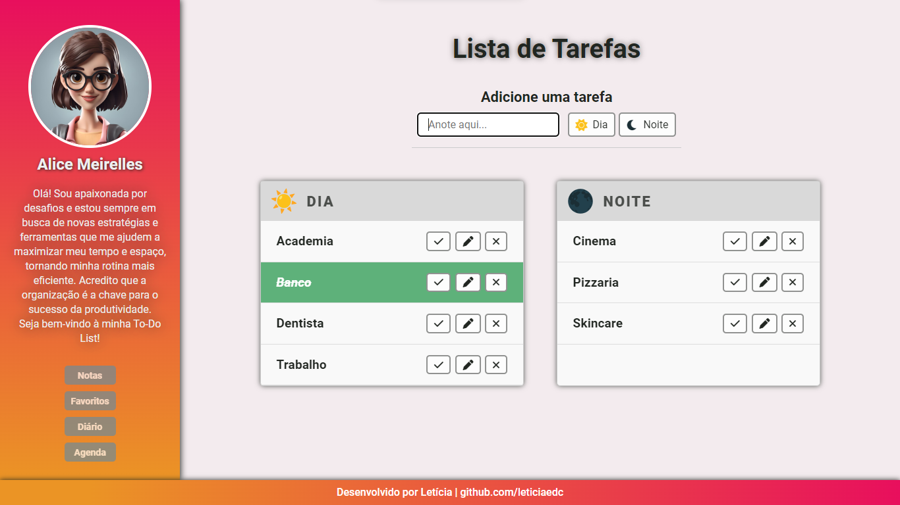
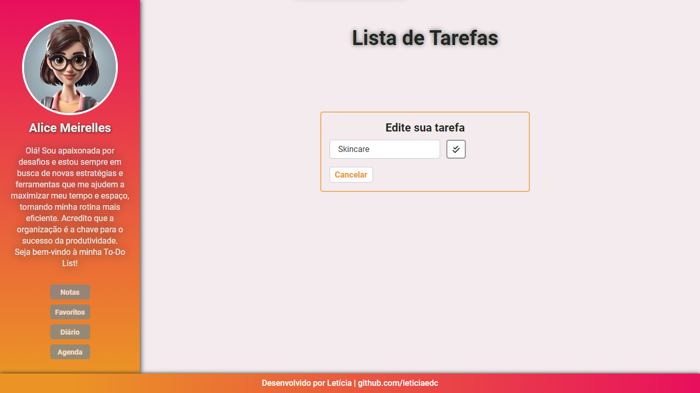
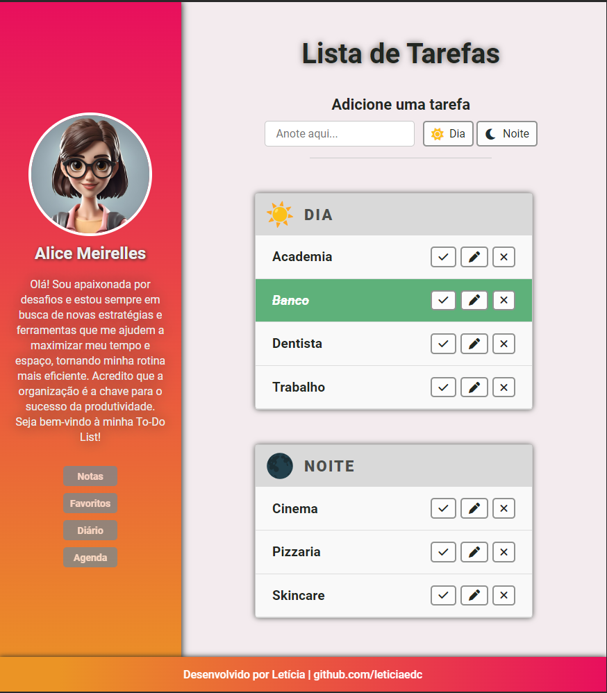
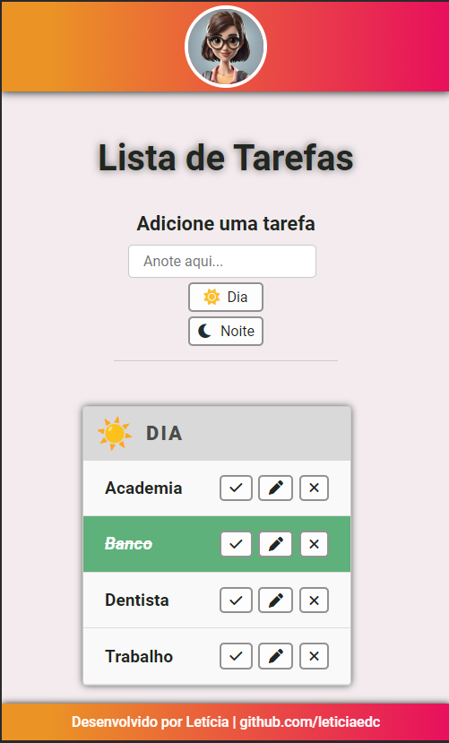

# Desafio To-Do List
Repositório referente à resolução de um desafio proposto pela Aceleradora Ágil (PUC-RS), como parte da 2ª fase do processo seletivo.

Trata-se da criação de um layout interativo e implementação de funcionalidades para uma To-Do List.

## Descrição do Projeto
A aplicação de Lista de Tarefas foi desenvolvida utilizando HTML, CSS e JavaScript, com manipulação do DOM, conceitos de responsividade e integração com o Local Storage para armazenamento de dados.

## Layout Responsivo 
<a href="https://leticiaedc.github.io/aceleradora-agil-layout/">Clique aqui</a> para conferir o layout da Lista de Tarefas. 

*Contém informações fictícias. 

 

## Recursos Principais
1. <b>Adicionar tarefas:</b> Permite aos usuários adicionar tarefas de forma intuitiva através de campos de entrada. Ao submeter uma nova tarefa, ela é instantaneamente exibida na lista, conforme o período desejado (Dia ou Noite).

2. <b>Edição de tarefa:</b> Possibilidade de editar uma tarefa existente. 

3. <b>Conclusão de tarefa</b>: As tarefas podem ser marcadas como concluídas, exibindo visualmente seu status.

4. <b>Remoção Tarefas:</b> O usuário pode deletar cada tarefa de sua lista correspondente.

5. <b>Armazenamento Local:</b>  Foi utilizado o Local Storage para persistência de dados, garantindo que as tarefas adicionadas permaneçam salvas, mesmo ao recarregar a página. 

## Autora
Letícia Endlich  <a href="https://www.linkedin.com/in/leticiaendlich/">Linkedin</a>